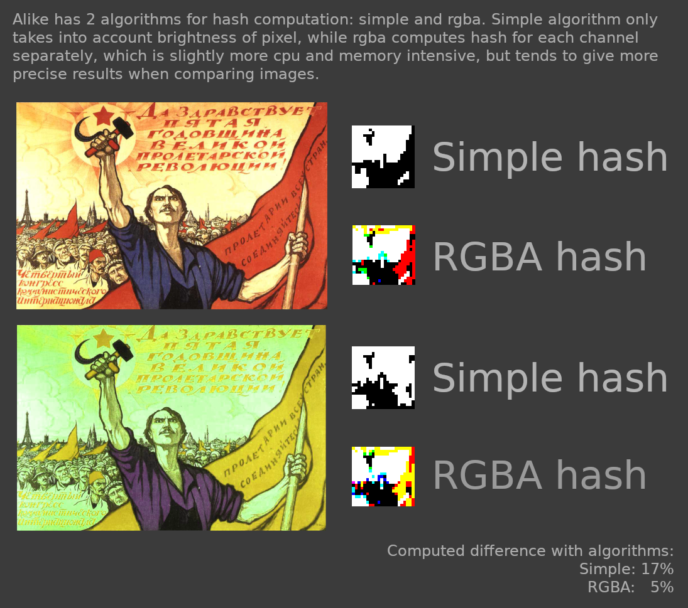

# Alike

A nim implementation of preceptual image hash.
Useful when searching for duplicate or similar pictures.

## How it works



Simple algorithm:
1. Get a small grayscale square image from original by scaling it
1. Compute average image brightness
1. Compare each pixel against average image brightness
1. Write the result into bit array where 1 is 'brighter' and 0 is 'darker'
1. Voila! We got the hash.

RGBA is basically simple algoritm x 4 for each channel.

Computing the difference is basically counting different bits in two hashes.

## Installation

1. Get source code by cloning this repository or downloading as zip
1. Open directory where the source code is in terminal and run `nimble build` (yeah, you'll need to have nimble installed first)
1. After successful build the binaries will be in `./bin` folder, you can run them

## Usage

CLI:

```
alike

Usage:
   [options] COMMAND

Commands:

  compare2         Compare 2 image files
  hash             Compute hash for image file

Options:
  -h, --help
  -a, --algorithm=ALGORITHM  Algorithm to use for hash computation Possible values: [simple, rgba] (default: rgba)
```

Embeding:

